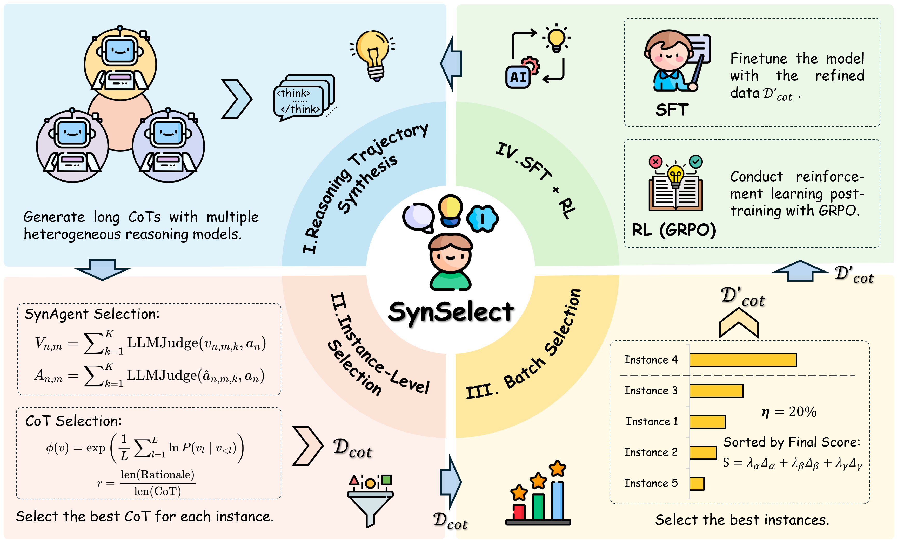
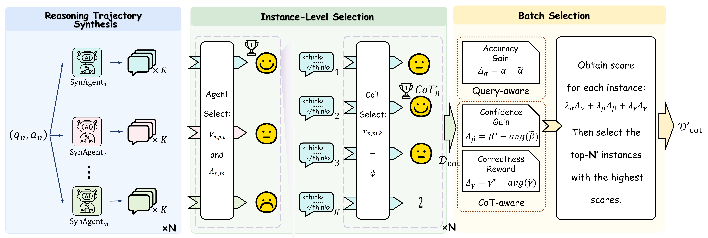
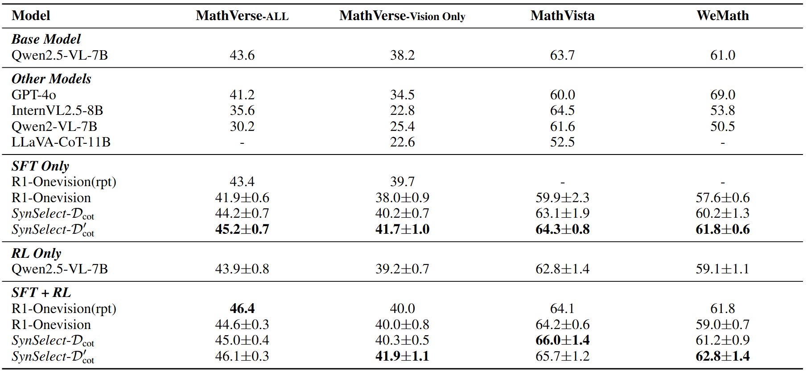
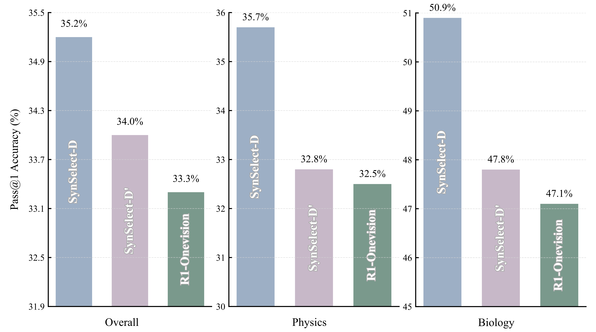
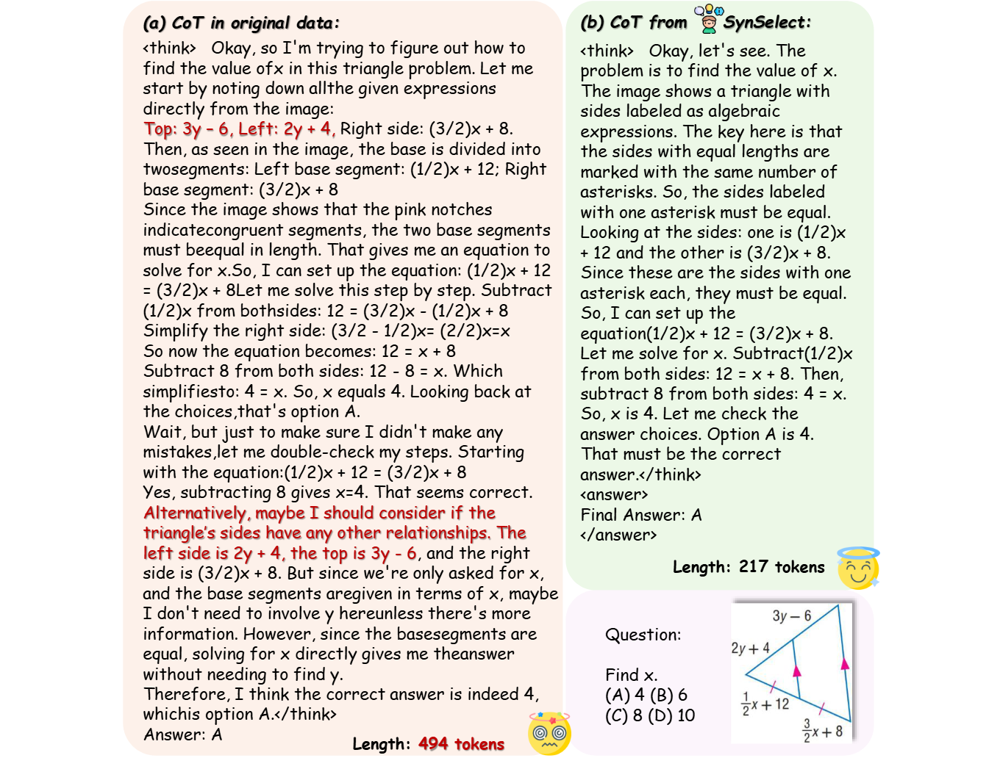

# SynSelect
The repository of "Training Multimodal Large Reasoning Models Needs Better Thoughts: A Three-Stage Framework for Long Chain-of-Thought Synthesis and Selection"

<p align="center">

</p>

## 💡 Overview

We introduce SynSelect, a novel framework that synthesizes and selects high-quality, concise, and accurate long Chain-of-Thought (CoT) data tailored for multimodal reasoning tasks. By leveraging multiple heterogeneous reasoning models and a two-level selection mechanism (instance + batch), SynSelect constructs superior training data that significantly boosts the performance of Multimodal Large Reasoning Models (MLRMs).

> Note: In addition to the core code, we provide an example of our synthesized data in ./data/data_example.json.

<p align="center">

</p>

## ⚡ Highlights

SynSelect operates in three key stages:

1. Synthesis:
Generate diverse long CoTs using multiple heterogeneous MLRMs (e.g., R1-OneVision, Vision-R1, MM-Eureka) with stochastic sampling.
2. Instance-level Selection:
For each question, select the best CoT based on:
    - Answer correctness
    - Reasoning validity (via a “small LLM judge”)
    - Length appropriateness (higher rationale ratio = less redundancy)
3. Selection:
From all instances, pick the most instructive subset using a scoring function that combines:  
Query-aware gain ($\Delta_\alpha$): How much does CoT improve accuracy?  
CoT-aware confidence ($\Delta_\beta$): Does CoT boost model confidence?  
Correctness reward ($\Delta_\gamma$): Is the answer truly reliable?   

## 📊 Performance

<p align="center">

</p>

Models fine-tuned on SynSelect data consistently outperform baselines. Moreover, $D'_{cot}$ (refined subset) further improves performance and training efficiency.

<p align="center">

</p>

In addition to evaluations on mathematical reasoning benchmarks, we also assessed the performance of SynSelect on a multi-domain benchmark. Experimental results demonstrate that models trained with SynSelect-synthesized data achieve significant performance improvements across a diverse range of domains.

## 🔍 Case Study

<p align="center">

</p>

In this geometry problem, SynSelect skips unnecessary checks, directly leverages visual cues ("red notches indicate congruent segments"), and arrives at the answer in 217 tokens vs. 494 tokens - with higher clarity and efficiency.

## 🗺️ Roadmap

### Data Preparation

We provide a unified script for inference and data synthesis. First, launch a `vllm` model service:

```bash
bash serve_vllm.sh <gpu_id> <checkpoint_path> <your_model_name>
```

Then, run inference with:

```bash
python cot_synthesis.py -i <gpu_id> -m <model_name> -d <dataset_directory> 
```

### Fine-Tuning

All SFT experiments in SynSelect are conducted using `LLama-Factory`. Install `LLama-Factory` from the official repository, then start SFT with:

```bash
DISABLE_VERSION_CHECK=1 FORCE_TORCHRUN=1 llamafactory-cli train LLama-Factory/examples/train_full/qwen2.5-vl_fullsft.yaml
```

### Evaluation

Evaluation in SynSelect is performed using `VLMEvalKit`. Install `VLMEvalKit` from its official repository, then run evaluation with:

```bash
bash python run.py \
    --data <benchmark_name> \
    --model <your_model> \
    --work-dir ./output
```

To accelerate inference with  `vllm`, register your model service in `VLMEvalKit/vlmeval/config.py`, and run:

```bash
bash python run.py \
    --data <benchmark_name> \
    --model <service_name> \
    --work-dir ./output \
    --api-nproc 64
```

## 📚 Citation
If this work is helpful, please kindly cite as:

```
@misc{wang2025trainingmultimodallargereasoning,
      title={Training Multimodal Large Reasoning Models Needs Better Thoughts: A Three-Stage Framework for Long Chain-of-Thought Synthesis and Selection}, 
      author={Yizhi Wang and Linan Yue and Min-Ling Zhang},
      year={2025},
      eprint={2512.18956},
      archivePrefix={arXiv},
      primaryClass={cs.AI},
      url={https://arxiv.org/abs/2512.18956}, 
}
```
